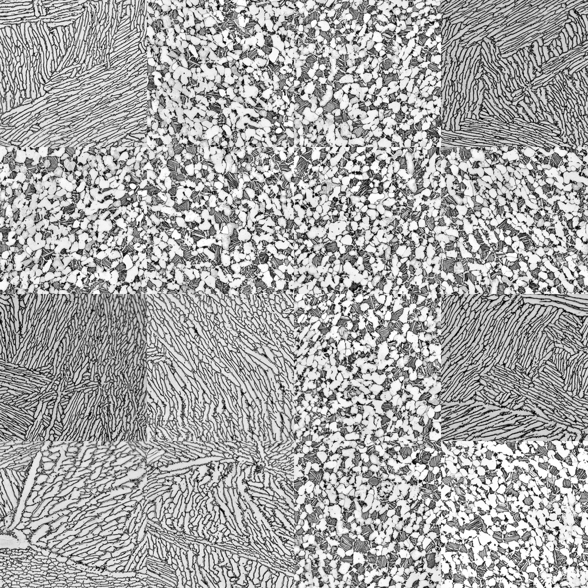
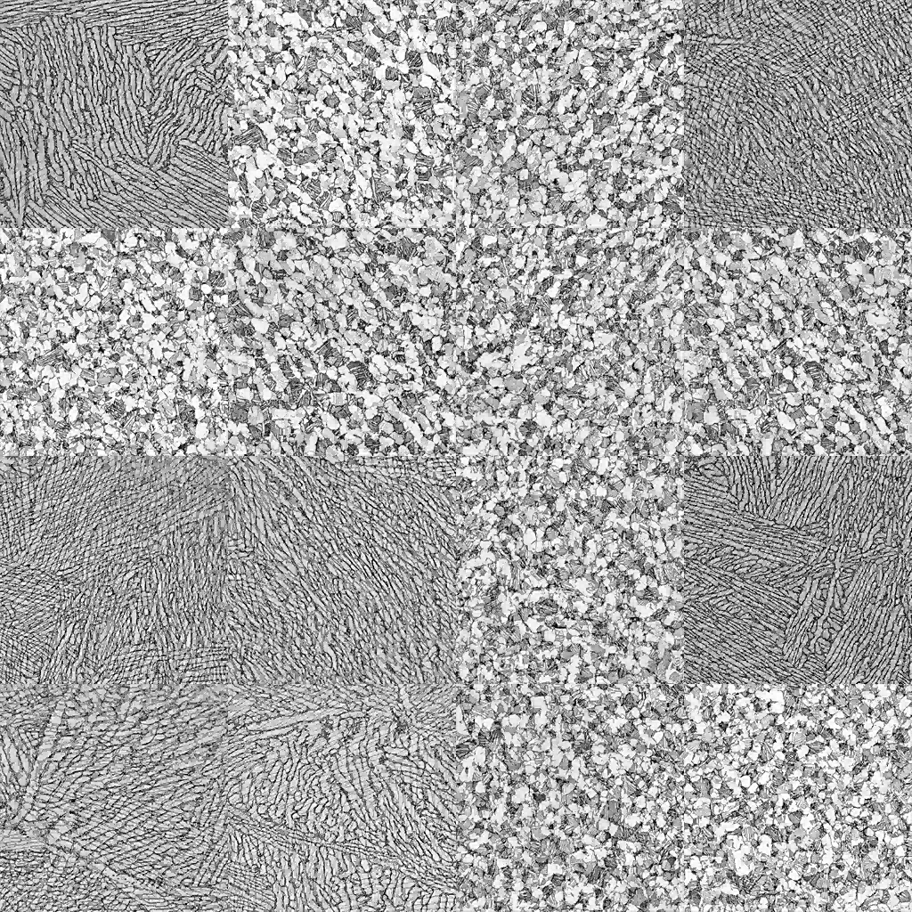

# Weld Wavelet Latent Decoder

<p align="center">
  
  
</p>

<p align="center"><em>Left: donor samples used by the latent decoder. Right: generated samples decoded from the learned wavelet latent prior.</em></p>

This repository contains the current, cleaned-up weld-image latent-space pipeline:
a learned continuous 2D lifting-wavelet codec, a Grassmannian metric over learned
wavelet feature subspaces, and a lightweight metric-space prior that can generate
new images through the decoder.

The previous VAE, VQ-VAE, PixelCNN, PDE, and operator-discovery attempts are kept
locally for reference but are intentionally ignored by Git. The public repo should
track only the working wavelet decoder code, reproducible commands, and lightweight
documentation. Private raw imagery, prepared datasets, checkpoints, metric archives,
priors, and generated samples are ignored.

## What The Pipeline Does

1. Converts raw RGB weld-camera JPGs to normalized greyscale tensors shaped
   `(N, 256, 256, 1)`.
2. Trains an interpretable learned lifting-wavelet codec in JAX.
3. Stores compact continuous latent codes: coarse coefficients plus sparse detail
   coefficients.
4. Builds a geometry-aware metric by extracting learned wavelet feature maps from
   the original images, fitting local low-rank subspaces, and comparing them with
   Grassmannian geodesic distances.
5. Embeds those distances with classical MDS to create an ordered Euclidean latent
   coordinate system.
6. Fits an adaptive KDE prior in the metric coordinates.
7. Samples that prior and decodes new images by interpolating nearby wavelet latents
   with spherical detail interpolation.

The current best raw-image path is the pre-automation metric-density workflow:
fit the wider prior at `runs/raw_learned_wavelet_prior_wide/prior.npz`, then
generate with `weld_latent.generate_wavelet_codec` into
`runs/raw_learned_wavelet_generated_density_wide`.

## Repository Layout

```text
.devcontainer/                  GPU-capable JAX devcontainer
prepare_dataset.py              RGB/JPG to greyscale NPZ preprocessing
README.md                       Repo overview and reproducible workflow
README_WAVELET_CODEC.md         Detailed wavelet-method notes and metrics
weld_latent/io.py               Image IO, greyscale conversion, resizing, PNG/PGM output
weld_latent/learned_wavelet.py  Learned lifting-wavelet analysis/synthesis code
weld_latent/optim.py            Small JAX Adam optimizer helper
weld_latent/train_wavelet_codec.py
weld_latent/fit_wavelet_metric.py
weld_latent/fit_wavelet_prior.py
weld_latent/generate_wavelet_codec.py
weld_latent/auto_generate_wavelet.py
```

Ignored local/private paths:

```text
raw/                            Original private RGB JPG frames
data/*.npz                      Prepared private datasets
runs/*                          Checkpoints, priors, generated images, metrics
info/                           Local paper PDFs and project notes
```

`data/README.md` and `runs/README.md` are tracked only as placeholders explaining
what belongs in those directories locally.

## Devcontainer

The project is intended to run inside the provided devcontainer. It installs Python
3.11, Git, build tools, JAX with CUDA 12 support, and Pillow for JPEG/PNG handling.
The host must expose NVIDIA GPUs to Docker if you want GPU execution.

Host smoke test:

```bash
nvidia-smi
docker run --rm --gpus all nvidia/cuda:12.2.0-base-ubuntu22.04 nvidia-smi
```

Inside the container:

```bash
python test_jax_gpu.py
```

Most verified commands below force CPU execution with `JAX_PLATFORMS=cpu` because
this codec is small and CPU execution avoids GPU allocator/autotuning surprises.
Remove that prefix if you want to try GPU execution.

## Reproduce The Current Raw-Image Workflow

Place private raw JPGs in `raw/` locally. They are not tracked by Git.

### 1. Prepare The Dataset

```bash
python prepare_dataset.py   --input 'raw/*.jpg'   --out data/raw_weld_256.npz   --size 256
```

Verified local run:

```text
raw frames: 113 RGB images, 2560 x 1920
dataset:    data/raw_weld_256.npz
shape:      (113, 256, 256, 1)
range:      [0.0, 0.7294]
mean/std:   0.2836 / 0.1089
```

### 2. Train The Learned Wavelet Codec

```bash
JAX_PLATFORMS=cpu python -m weld_latent.train_wavelet_codec   --dataset data/raw_weld_256.npz   --image-size 256   --out runs/raw_learned_wavelet_codec   --steps 600   --batch-size 8   --eval-batch-size 16   --selection-interval 25   --seed 7
```

Important outputs:

```text
runs/raw_learned_wavelet_codec/checkpoint.pkl
runs/raw_learned_wavelet_codec/latent_codes.npz
runs/raw_learned_wavelet_codec/metrics.json
```

Verified local metrics:

```text
selected step:           50
trained PSNR:            38.35 dB
trained edge ratio:      0.9952
validation PSNR:         38.55 dB
validation edge ratio:   0.9969
```

### 3. Fit The Grassmannian Metric

```bash
JAX_PLATFORMS=cpu python -m weld_latent.fit_wavelet_metric   --checkpoint runs/raw_learned_wavelet_codec/checkpoint.pkl   --dataset data/raw_weld_256.npz   --out runs/raw_learned_wavelet_metric   --batch-size 16
```

Important outputs:

```text
runs/raw_learned_wavelet_metric/metric.npz
runs/raw_learned_wavelet_metric/embedding.csv
runs/raw_learned_wavelet_metric/neighbor_indices.csv
runs/raw_learned_wavelet_metric/metrics.json
```

Verified local metrics:

```text
Grassmann/MDS distance correlation: 0.9342
Normalized stress:                  0.3054
Neighbor overlap at 16:              0.6787
```

### 4. Fit The Metric-Space Prior

Default prior:

```bash
python -m weld_latent.fit_wavelet_prior   --metric runs/raw_learned_wavelet_metric/metric.npz   --out runs/raw_learned_wavelet_prior
```

Wider prior, currently the recommended raw-image generator:

```bash
python -m weld_latent.fit_wavelet_prior   --metric runs/raw_learned_wavelet_metric/metric.npz   --out runs/raw_learned_wavelet_prior_wide   --bandwidth-scale 0.85
```

### 5. Generate With The Known-Good Wide Density Workflow

The recommended generator is the original metric-density probe, not the later
automation wrapper. It uses the raw learned wavelet codec, the Grassmann/MDS
metric, and the wider KDE prior, then writes the full diagnostic bundle:
generated images, nearest-source matches, coarse donors, interpolation checks,
coordinates, and `metrics.json`.

```bash
JAX_PLATFORMS=cpu python -m weld_latent.generate_wavelet_codec \
  --checkpoint runs/raw_learned_wavelet_codec/checkpoint.pkl \
  --codes runs/raw_learned_wavelet_codec/latent_codes.npz \
  --metric runs/raw_learned_wavelet_metric/metric.npz \
  --prior runs/raw_learned_wavelet_prior_wide/prior.npz \
  --dataset data/raw_weld_256.npz \
  --out runs/raw_learned_wavelet_generated_density_wide \
  --samples 16 \
  --seed 4
```

Important outputs:

```text
runs/raw_learned_wavelet_generated_density_wide/generated_montage.png
runs/raw_learned_wavelet_generated_density_wide/coarse_donor_montage.png
runs/raw_learned_wavelet_generated_density_wide/nearest_source_montage.png
runs/raw_learned_wavelet_generated_density_wide/interpolation_montage.png
runs/raw_learned_wavelet_generated_density_wide/metrics.json
```

Verified local metrics:

```text
edge-energy ratio vs source:   0.9884
nearest-source MSE:            0.00208
near-white fraction:           0.0000
phase-mean range:              0.00157
```

### 6. Optional Automated Smoke Sampling

`weld_latent.auto_generate_wavelet` is useful for unattended smoke runs, but it is
not currently the preferred quality path. It reuses the same raw codec, metric, and
wide prior by default, yet the latest automated run was visually worse than the
known-good wide density run and produced a higher nearest-source MSE. Treat it as
a convenience wrapper until it reproduces the older generator behavior exactly.

```bash
JAX_PLATFORMS=cpu python -m weld_latent.auto_generate_wavelet \
  --out runs/raw_learned_wavelet_auto \
  --samples 32 \
  --batch-size 16 \
  --seed 12
```

Verified 8-sample smoke run:

```text
edge-energy ratio vs source:   0.9947
nearest-source MSE:            0.00344
near-white fraction:           0.0000
phase-mean range:              0.00152
```

## Core Commands At A Glance

```bash
python prepare_dataset.py --input 'raw/*.jpg' --out data/raw_weld_256.npz --size 256

JAX_PLATFORMS=cpu python -m weld_latent.train_wavelet_codec   --dataset data/raw_weld_256.npz --image-size 256   --out runs/raw_learned_wavelet_codec --steps 600 --batch-size 8   --eval-batch-size 16 --selection-interval 25 --seed 7

JAX_PLATFORMS=cpu python -m weld_latent.fit_wavelet_metric   --checkpoint runs/raw_learned_wavelet_codec/checkpoint.pkl   --dataset data/raw_weld_256.npz --out runs/raw_learned_wavelet_metric   --batch-size 16

python -m weld_latent.fit_wavelet_prior   --metric runs/raw_learned_wavelet_metric/metric.npz   --out runs/raw_learned_wavelet_prior_wide --bandwidth-scale 0.85

JAX_PLATFORMS=cpu python -m weld_latent.generate_wavelet_codec   --checkpoint runs/raw_learned_wavelet_codec/checkpoint.pkl   --codes runs/raw_learned_wavelet_codec/latent_codes.npz   --metric runs/raw_learned_wavelet_metric/metric.npz   --prior runs/raw_learned_wavelet_prior_wide/prior.npz   --dataset data/raw_weld_256.npz   --out runs/raw_learned_wavelet_generated_density_wide --samples 16 --seed 4
```

## Publishing To GitHub

The repo is designed so private data and generated outputs stay untracked. Before
pushing, check:

```bash
git status --short
git status --ignored --short
```

Expected tracked surface is source code, `.devcontainer/`, `.gitignore`, and docs.
Expected ignored surface includes `raw/`, `data/*.npz`, `runs/*`, `info/`, and older
experimental attempts.

After creating an empty GitHub repository, link and push with:

```bash
git remote add origin git@github.com:<your-user>/<your-repo>.git
git push -u origin main
```

## Notes

- The generator is not a GAN or diffusion model. It samples a learned metric-space
  KDE and decodes through nearby continuous wavelet latents.
- The raw source images look sequence-like, so nearest-source MSE can be small even
  when samples are newly decoded combinations.
- The tracked code is intentionally minimal. Old explorations are ignored rather
  than deleted so the local workspace can still reference them if needed.
